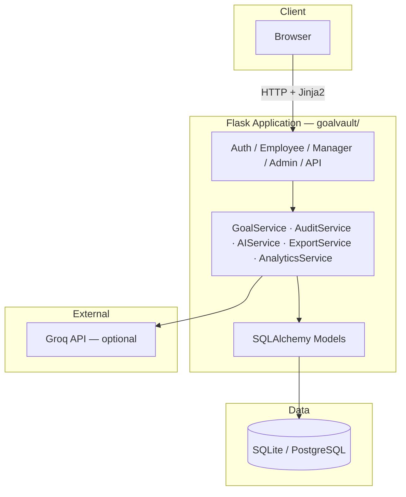
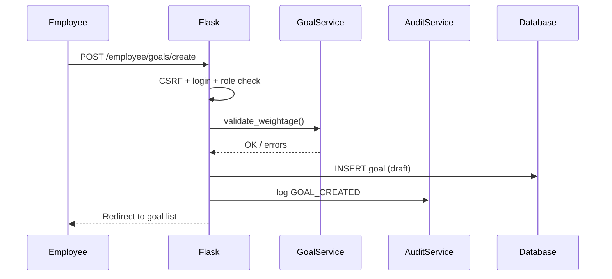
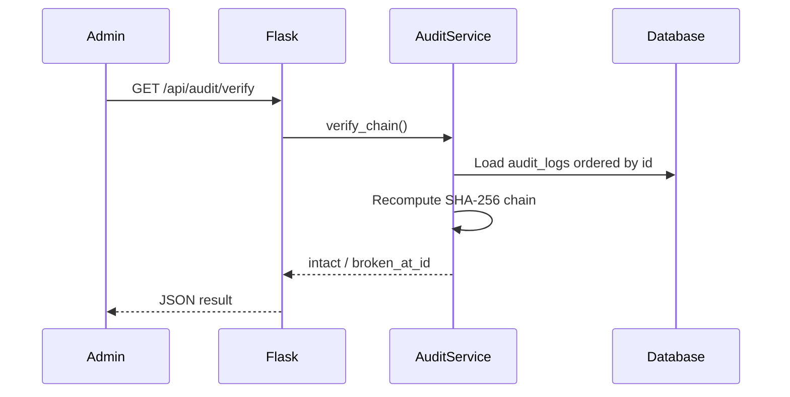

# GoalVault — AtomQuest Hackathon 1.0

**Set goals with clarity. Track with confidence. Secured by design.**

GoalVault is a security-first, AI-assisted **Goal Setting & Tracking Portal** for the AtomQuest Hackathon. It covers employee goal creation, manager approval, quarterly achievements, admin oversight, hash-chained audit logs, and optional Groq-powered AI coaching.

---

## Table of Contents

1. [Features](#features)
2. [Architecture](#architecture)
3. [Request Flow](#request-flow)
4. [Project Structure](#project-structure)
5. [How to Run (Quick Start)](#how-to-run-quick-start)
6. [Demo Accounts](#demo-accounts)
7. [Environment Variables](#environment-variables)
8. [Deployment](#deployment)
9. [Push to GitHub](#push-to-github)
10. [What Is Not in Git](#what-is-not-in-git)

---

## Features

| Area | Capability |
|------|------------|
| **Employee** | Create/edit goals, weightage validation (10% min, 100% max, 8 goals), Q1–Q4 achievements, progress widget |
| **Manager** | Approve/return goals, inline target edits, team view, AI check-in summary |
| **Admin** | Users, cycle config, completion dashboard, analytics (Chart.js), escalations, audit trail verify, Excel export |
| **Security** | SHA-256 hash-chain audit log, CSRF, rate limiting, role decorators, security headers |
| **AI** | Groq Llama 3.3 (optional); demo mode works without API key |

---

## Architecture



---

## Request Flow

### Employee creates a goal



### Admin verifies audit chain



---

## Project Structure

```
Aatomquest/
├── README.md                 # This file
├── .gitignore                # Excludes venv, .env, *.db, etc.
├── scripts/
│   └── push_to_github.py     # git + gh commit/push helper
└── goalvault/                # Flask application
    ├── run.py                # Entry point (port 8080)
    ├── config.py
    ├── seed_data.py          # Demo users & sample goals
    ├── requirements.txt
    ├── .env.example
    ├── Procfile              # gunicorn for Railway/Render
    └── app/
        ├── __init__.py       # App factory
        ├── extensions.py
        ├── models/           # User, Goal, Achievement, AuditLog, …
        ├── routes/           # auth, employee, manager, admin, api
        ├── services/         # Business logic layer
        ├── templates/        # Jinja2 + Vault UI
        └── static/           # CSS, JS
```

---

## How to Run (Quick Start)

### 1. Prerequisites
- Python 3.10 or newer
- pip

### 2. Open the Project Folder
```bash
cd goalvault
```

### 3. Create and Activate Virtual Environment
**macOS / Linux:**
```bash
python3 -m venv venv
source venv/bin/activate
```
**Windows:**
```bash
python -m venv venv
venv\Scripts\activate
```

### 4. Install Dependencies
```bash
pip install -r requirements.txt
```

### 5. Configure Environment Variables
Copy the example env file:
```bash
cp .env.example .env
```
Edit `.env` and set at minimum:
- `SECRET_KEY`: Any random string for sessions (Required)
- `GROQ_API_KEY`: Key from [console.groq.com](https://console.groq.com) for live AI. If empty, it falls back to demo text.

### 6. Seed the Demo Database
```bash
python seed_data.py
```
This creates three demo users and sample goals with audit log entries.

### 7. Start the Application
```bash
python run.py
```
Open **http://localhost:8080** in your browser.

---

## Demo Accounts

| Role | Email | Password |
|------|-------|----------|
| Employee | `employee@goalvault.com` | `Demo@123` |
| Manager | `manager@goalvault.com` | `Demo@123` |
| Admin | `admin@goalvault.com` | `Demo@123` |

---

## Environment Variables

| Variable | Required | Description |
|----------|----------|-------------|
| `SECRET_KEY` | Yes | Flask session secret |
| `GROQ_API_KEY` | Optional | Live AI via Groq. (Falls back to demo mode without it). |
| `DATABASE_URL` | Optional | Default: `sqlite:///goalvault.db` |
| `FLASK_ENV` | Optional | `development` or `production` |
| `PORT` | Optional | Default `8080` in `run.py` |

**Never commit `.env`.**

---

## Deployment

**Production setup:**
```bash
pip install gunicorn
export FLASK_ENV=production
# Add your production database URL if not using SQLite
export DATABASE_URL=postgresql://...
python seed_data.py
gunicorn run:app --bind 0.0.0.0:5000
```

Alternatively, use the included `Procfile` to deploy directly to Railway or Render. Simply set your Environment Variables (like `SECRET_KEY` and `GROQ_API_KEY`) in the host's dashboard.

---

## Push to GitHub

Prerequisites: [Git](https://git-scm.com/), [GitHub CLI](https://cli.github.com/) (`gh auth login`).

From the **repository root** (`Aatomquest/`):

```bash
# Preview what would be added
python scripts/push_to_github.py --dry-run

# First upload (creates repo + push)
python scripts/push_to_github.py \
  --message "Initial commit: GoalVault AtomQuest hackathon" \
  --create-repo \
  --repo goalvault \
  --visibility public

# Later updates
python scripts/push_to_github.py -m "Fix employee goal creation"
```

Options: `--no-push` (commit only), `--branch main`, `--private`, `--repo your-name`.

---

## What Is Not in Git

The script and `.gitignore` block these paths:

| Excluded | Reason |
|----------|--------|
| `venv/`, `.venv/` | Recreate with `pip install` |
| `.env` | Secrets |
| `*.db` | Local database |
| `__pycache__/`, `*.pyc` | Generated |
| `.DS_Store` | OS noise |

---

## Tech Stack

- **Backend:** Python 3.10+, Flask 3, SQLAlchemy, Flask-Login, Flask-WTF, Flask-Limiter  
- **Frontend:** Jinja2, Bootstrap 5, Chart.js, custom Vault dark UI  
- **AI:** Groq API (Llama 3.3 70B), optional  
- **Export:** openpyxl, pandas  

---

## License

Built for **AtomQuest Hackathon 1.0**. Use and adapt per your hackathon / org rules.
